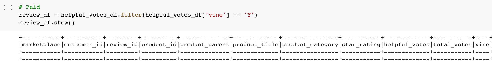
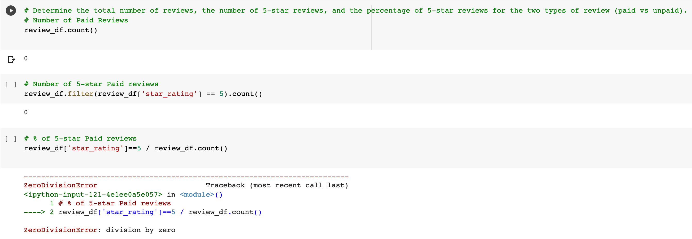
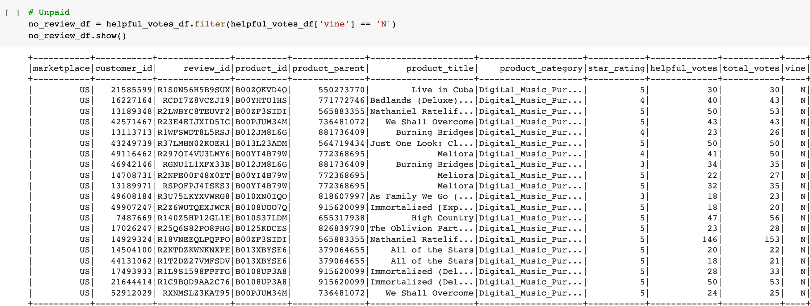

# Amazon Vine Analysis
#### Google Colab, AWS, SQL, Python, Spark

## Overview
This analysis took a look at Amazon reviews written by members of the paid Amazon Vine program. Our dataset was of [digital music purchases](https://s3.amazonaws.com/amazon-reviews-pds/tsv/amazon_reviews_us_Digital_Music_Purchase_v1_00.tsv.gz).
The goal is to compare how many 5-star reviews were written by paid Amazon Vine members versus unpaid members.

## Results
### Vine Reviews
- There were zero paid Vine reviews, as you can see in the diagram below:

- As such, there were zero 5-star paid Vine reviews
- A percentage cannot be calculated

### Unpaid Reviews
- There were 4,532 unpaid reviews, 20 of which you can see in the diagram below:
- 
- Of the 4,532 unpaid reviews, 2,507 were 5-star reviews
- 55.32% of all unpaid reviews were 5-star reviews
<"Resources/Unpaid_Reviews1.png", width="500">

## Summary
This dataset doesn't help us to compare reviews written by members of the paid Amazon Vine program, however, it is clear that Vine members are not reviewing digital music purchases.

## Additional Analysis
Why are Vine members not reviewing digital music purchases? What are Vine members reviewing?
